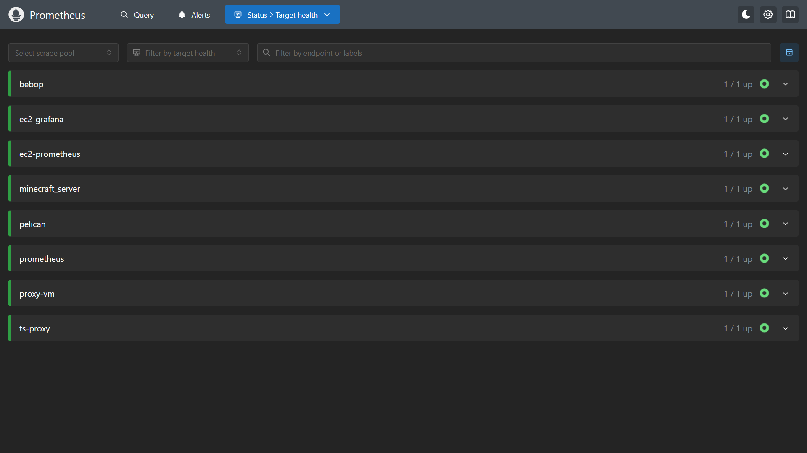
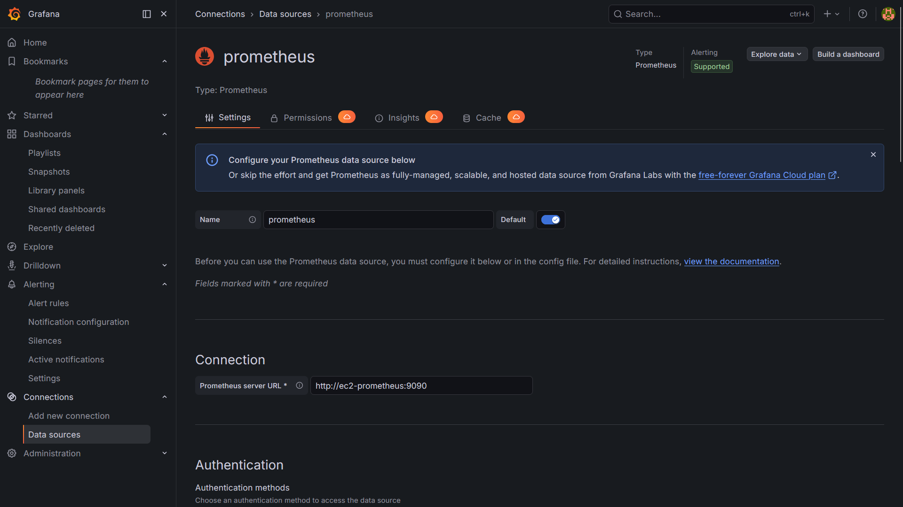
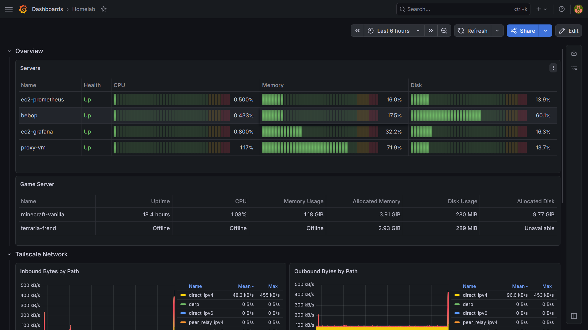
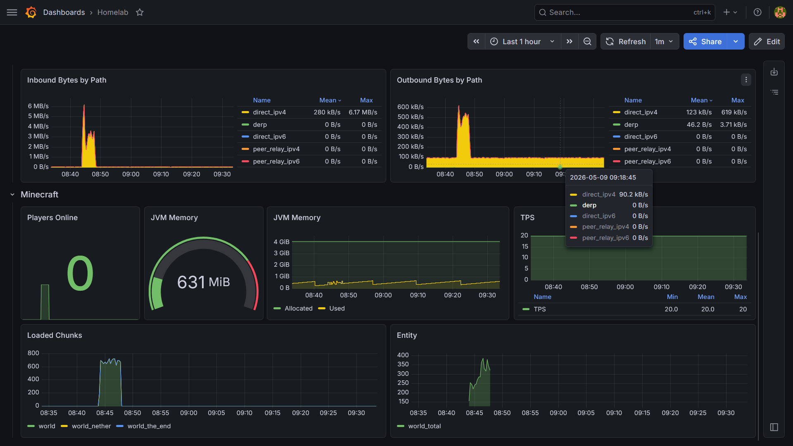
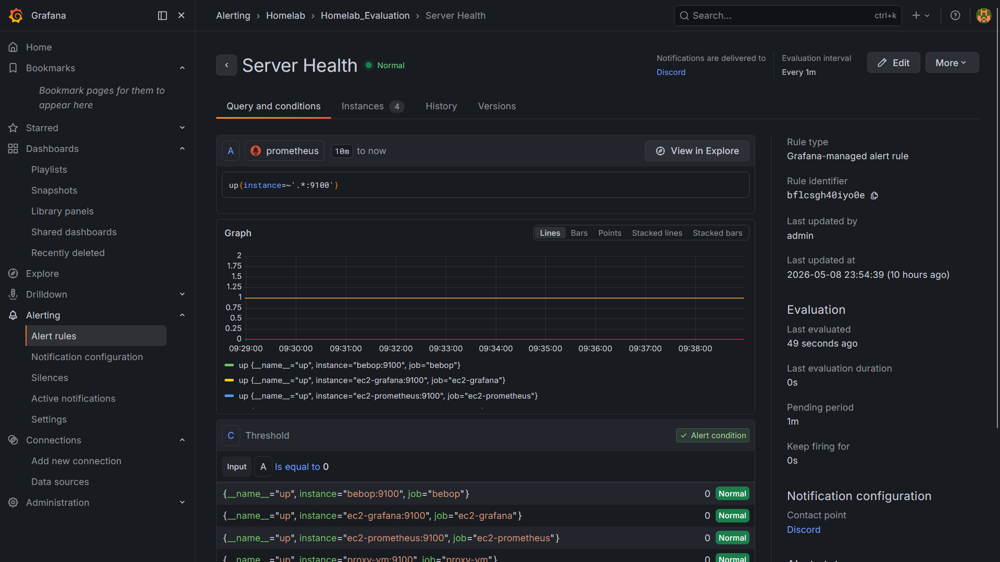
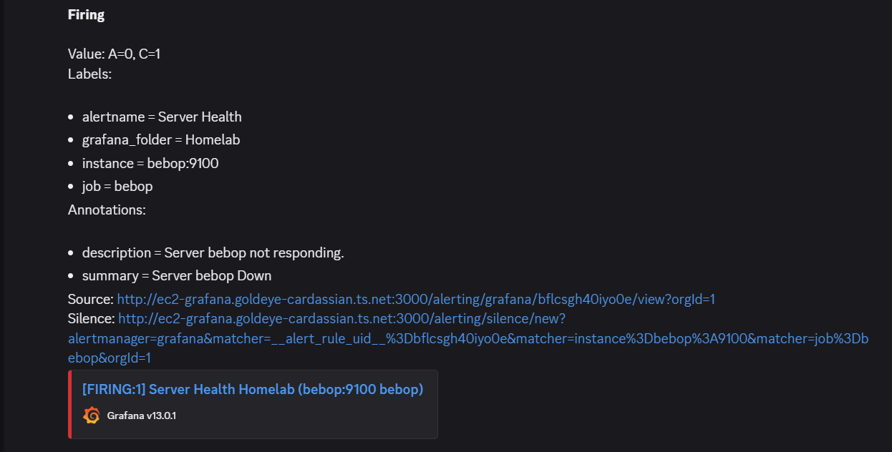
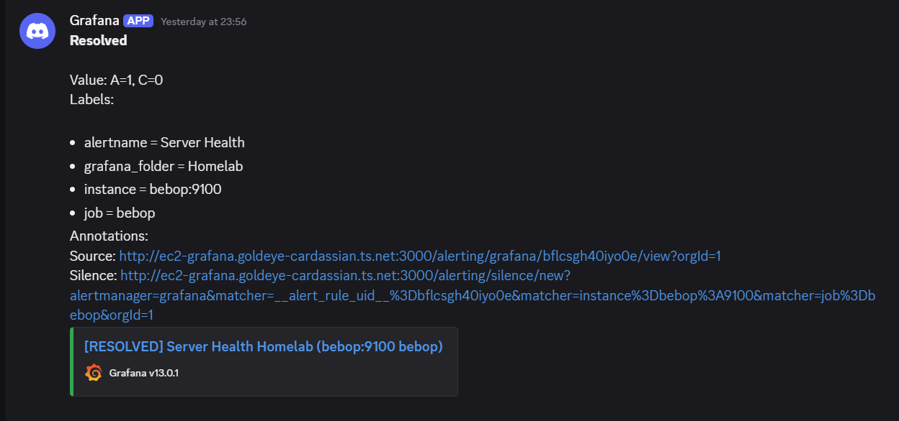

# Modul 3: Monitoring System

### Deskripsi Arsitektur Sistem Monitoring

Sistem monitoring terdiri atas Prometheus dan Grafana yang masing-masing berjalan di instance AWS EC2. Untuk target monitoring dijelaskan lebih lanjut dalam bullet points berikut:

- Dua instance AWS EC2, masing-masing terdapat node exporter.
- Homeserver yang menjalankan Pelican Panel & Wings, terpasang node exporter dan pelican exporter.
- Azure VM yang menjalankan container Traefik, terpasang node exporter juga.
- Container server Minecraft yang dikelola oleh Pelican pada homeserver, terpasang plugin minecraft-prometheus-exporter.
- Tailscale metrics yang dibuka di Azure VM.

Semua host yang telah disebutkan di atas terkoneksi salam satu VPN Tailscale. Dengan demikian, setiap host cukup menggunakan private IP atau MagicDNS Tailscale untuk berkomunikasi dengan host lain.

### Integrasi Prometheus & Grafana

Pertama, setiap exporter harus disiapkan terlebih dahulu di masing-masing host. Untuk node exporter, instalasi harus dilakukan secara bare metal karena tujuan node exporter adalah melakukan mengumpulkan metrics hardware host. Dengan demikian, instalasi node exporter menggunakan rangkaian command seperti yang ada di modul. Hasil metrics selanjutnya dapat diakses melalui port `9100`.

Untuk pelican exporter, saya menggunakan docker image yang sudah ada di luar sana, `loens2/pterodactyl_exporter`. Untuk menyiapkannya, harus disiapkan terlebih dahulu user baru khusus monitor. Setelah sudah dibuat, user dijadikan subuser pada setiap game server yang ingin di-scrape metricsnya. Untuk permission subuser cukup dengan backup->read. Dari setting profil monitor bot, kita dapat mengambil client API Key yang diperlukan untuk sarana komunikasi exporter dengan Pelican Panel. Metrics dapat diakses melalui port `9531`.

Untuk plugin minecraft-prometheus-exporter, cukup dilakukan dengan mendownload pluginnya dan meletakkan `JAR` file-nya ke dalam direktori plugins. Metrics kemudian dapat diakses melalui port `9940`.

Terakhir, untuk melakukan scraping terhadap metrics network Tailscale, dapat dilakukan dengan menjalankan satu command berikut pada host yang diinginkan:
```bash
tailscale set --webclient
```
Metrics dapat diakses melalui port `5252`.

#### Konfigurasi Prometheus

Setelah semua exporter yang dibutuhkan sudah disiapkan, Prometheus dikonfigurasi agar dapat melakukan pull terhadap setiap HTTP endpoint yang sudah didapat sebelumnya. Berikut adalah konfigurasi `prometheus.yaml` yang digunakan, berisi job scraping untuk setiap exporter yang sudah disiapkan sebelumnya:
```yml
global:
  scrape_interval: 15s
  evaluation_interval: 15s

rule_files:

scrape_configs:
- job_name: "ec2-prometheus"
  static_configs:
    - targets: ["ec2-prometheus:9100"]

- job_name: "ec2-grafana"
  static_configs:
    - targets: ["ec2-grafana:9100"]

- job_name: "bebop"
  static_configs:
    - targets: ["bebop:9100"]

- job_name: "ts-proxy"
  static_configs:
    - targets: ["proxy-vm:5252"]

- job_name: "proxy-vm"
  static_configs:
    - targets: ["proxy-vm:9100"]

- job_name: "pelican"
  static_configs:
    - targets: ["bebop:9531"]

- job_name: "minecraft_server"
  static_configs:
    - targets: ["bebop:9940"]
```
Perhatikan penggunaan MagicDNS di konfigurasi di atas. Secara default, Docker container akan secara otomatis menggunakan nameserver yang sama digunakan oleh host.

Berikut screenshot endpoint `/targets` web Prometheus, terlihat bahwa setiap target dapat diakses oleh Prometheus.


#### Konfigurasi Data Source di Grafana

Karena Prometheus dan Grafana berada pada satu VPN yang sama, maka tidak diperlukan manajemen jaringan tambahan di sisi AWS. Untuk konfigurasi data source Prometheus di Grafana cukup dengan mencantumkan IP Tailscale dari Prometheus, seperti screenshot di bawah ini:



### Custom Dashboard

Sesuai dengan permintaan penugasan, dashboard berikut dibuat secara custom, disesuaikan dengan usecase infrastruktur yang ada. Dashboard meliputi overview metrik semua server/caontainer, performa I/O jaringan Tailscale, dan metrik server Minecraft. 





### Sistem Alert

Sistem monitoring yang dibuat juga menyediakan Grafana alerting sederhana terhadap webhook Discord. Metrics alerting yang digunakan adalah query `up == 0`, yakni health check terhadap setiap host yang di-scrape oleh Prometheus. Apabila target tidak dapat dijangkau, maka nilai `up == 0` menjadi `true` sehingga menyebabkan transisi status dari "normal" ke "firing". Apabila status "firing" terjadi, Grafana langsung mengirimkan payload alert ke webhook Discord. 

Berikut adalah beberapa screenshot terkait sistem alerting yang sudah dibuat:
- Tampilan halaman alert rules untuk alert "Server Health":
  
- Firing alert yang berhasil terkirim melalui webhook Discord:
  
- Resolved alert apabila status kembali normal:
  

### Alur Monitoring

Berikut adalah alur monitoring singkat berdasarkan sistem yang telah dibuat secara bertahap:
1. Setiap exporter mengumpulkan metrics pada masing-masing target. Metrics yang didapat kemudian akan disediakan melalui endpoint HTTP `/metrics` dengan port tertentu tergantung jenis exporter.
2. Prometheus melakukan scraping setiap interval tertentu pada setiap endpoint yang sudah dikonfigurasikan pada `prometheus.yaml`. Semua data metrics kemudian akan disimpan dalam TSDB (time-series database).
3. Dashboard Grafana yang sudah disiapkan sebelumnya akan mengirimkan HTTP request berisi query PromQL terhadap instance Prometheus yang dijadikan data source. Prometheus kemudian akan membalas request tersebut dengan data numerik yang sesuai. Dari data numerik ini, Grafana dapat mengolahnya kembali menjadi visualisasi yang deskriptif.
4. Apabila Alerting sudah disiapkan, Grafana akan terus memantau data numerik dari query yang telah ditentukan. Apabila kondisi query terpenuhi, Alert akan bertransisi dari status "normal" ke "firing" dan mengirimkan notifikasi secara otomatis ke Webhook yang sudah disambungkan.