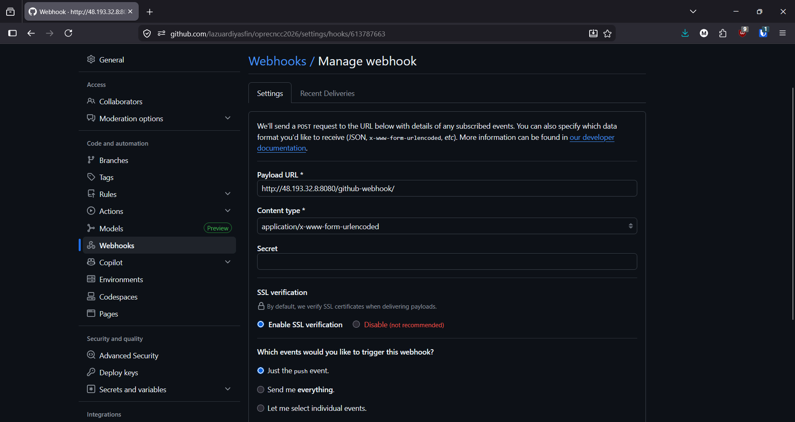
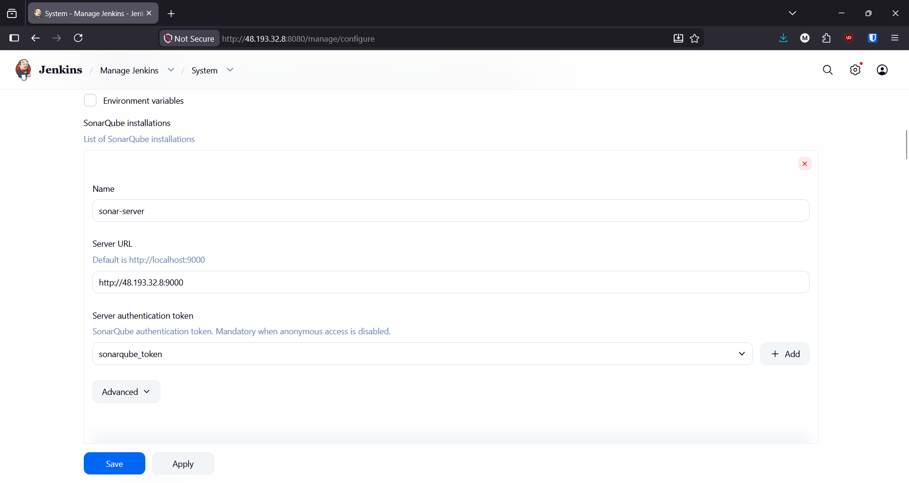
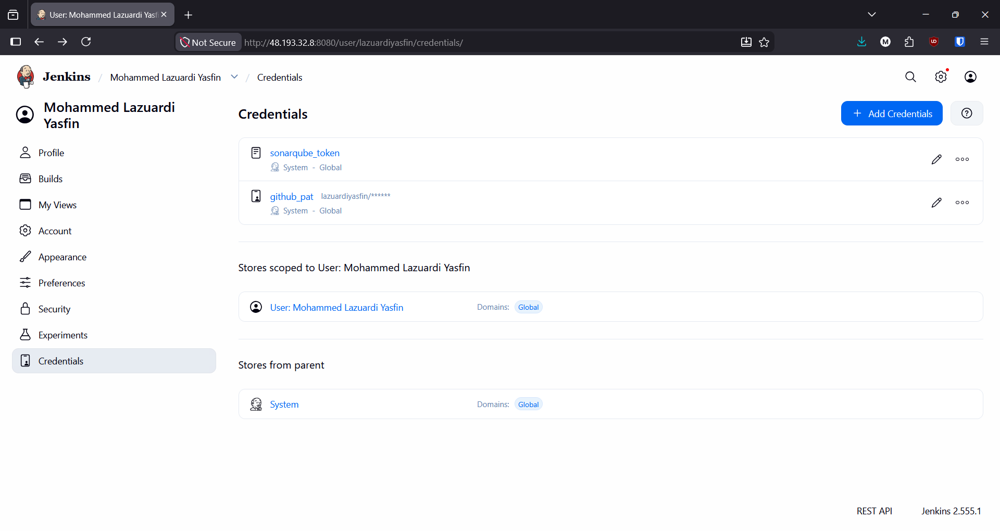
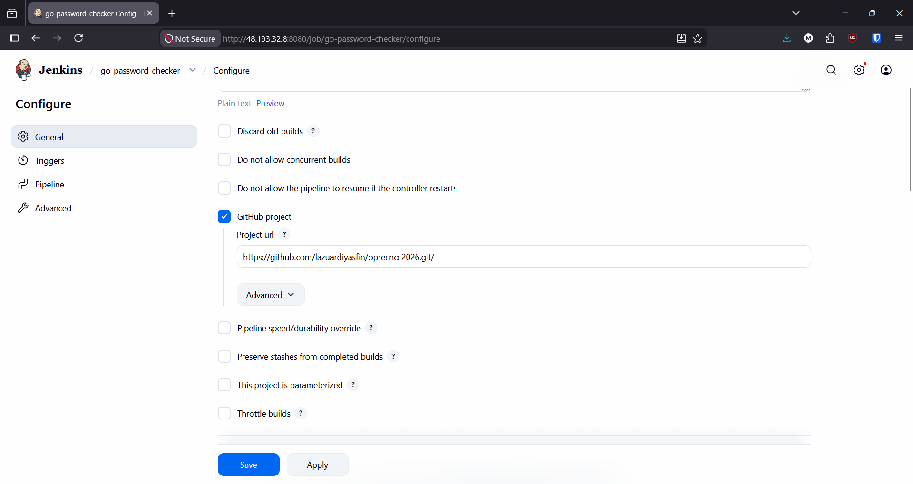
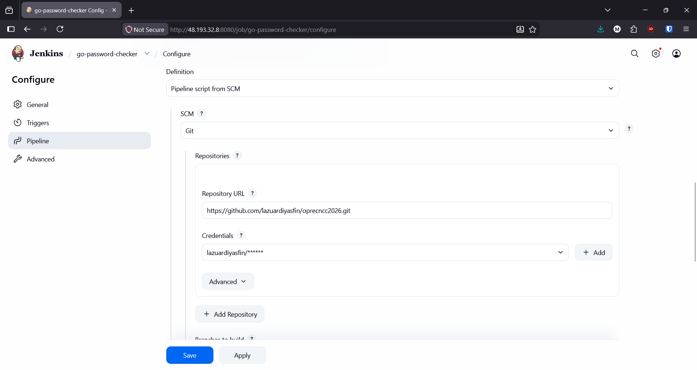
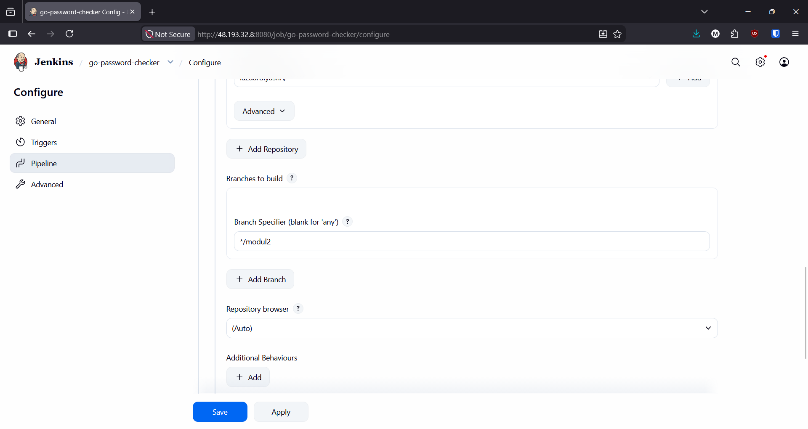
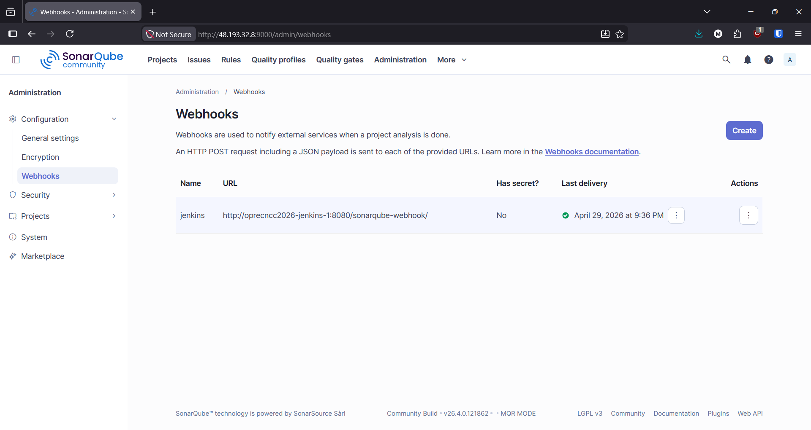
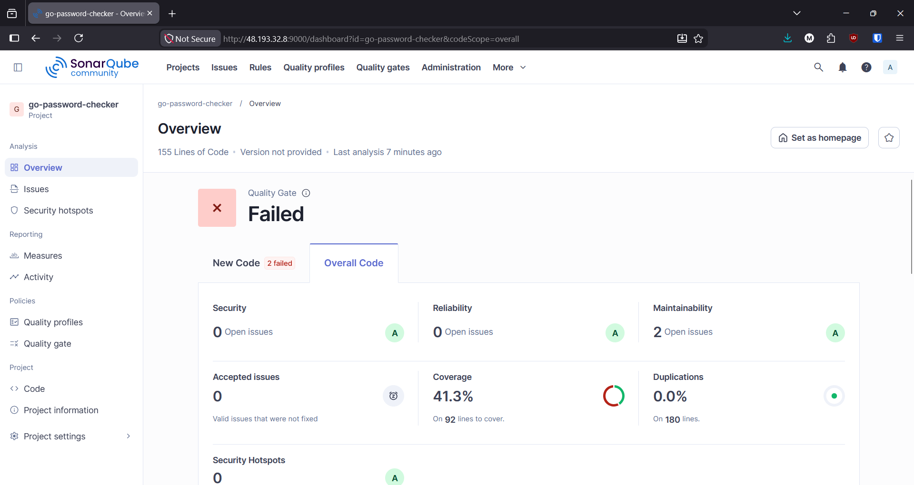
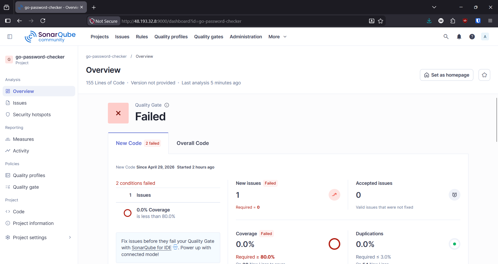
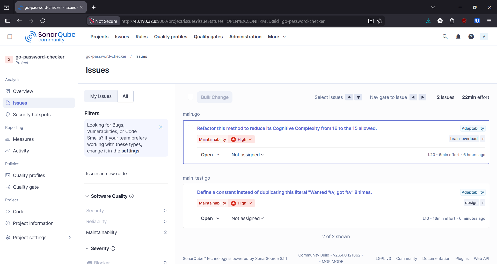

# Modul 2: CI/CD

[](http://48.193.32.8:8080/job/go-password-checker/)
[](http://48.193.32.8:9000/dashboard?id=go-password-checker)

### Deskripsi Pipeline

Pipeline yang dibuat adalah continuous integration (CI) untuk proyek berbasis Go dengan integrasi SonarQube untuk static code analysis. Pipeline otomatis dijalankan setiap kali terjadi `git push` oleh developer. Di akhir pipeline, terdapat quality gate yang memastikan pipeline gagal apabila standar kualitas kode tidak terpenuhi. Pipeline ini juga menyediakan badge untuk build & quality status yang dapat diakses di README ini.

### Integrasi Jenkins dan SonarQube

Berdasarkkan Jenkinsfile yang dibuat, integrasi SonarQube dilakukan pada stage "SonarQube Analysis". Pada stage ini, Jenkins menjalankan container Docker dengan image 'sonarsource/sonar-scanner-cli' untuk melakukan analisis kode statis. Alasan penggunaan image ini daripada plugin adalah untuk memudahkan proses pipeline dan menghindari masalah permission pada container agent. 

```groovy
stage('SonarQube Analysis') {
    agent {
        docker {
            image 'sonarsource/sonar-scanner-cli'
            reuseNode true
        }
    }
    steps {
        withSonarQubeEnv(SONAR_SERVER) {
            sh """
                sonar-scanner \
                -Dsonar.projectKey=${PROJECT_KEY} \
                -Dsonar.sources=. \
                -Dsonar.go.coverage.reportPaths=coverage.out 
            """
        }
    }
}
```

Agar SonarQube Scanner CLI dapat mengirimkkan hasil analisis ke SonarQube Server, perlu ditambahkan konfigurasi sistem tambahan pada Jenkins. Konfigurasi yang dimaksud adalah menspesifikasikan instalasi SonarQube server, seperti URL server dan token SonarQube (konfigurasi lebih lanjut dapat dilihat [disini](#konfigurasi-jenkins)). Selanjutnya, agar SquareQube Server bisa mengirimkan status quality gate kembali ke Jenkins, perlu ditambahkan konfigurasi Webhook pada SonarQUbe Server. 


### Konfigurasi Jenkins & SonarQube

- Konfigurasi Webhook GitHub ke Jenkins:

    

- Konfigurasi Instalasi SonarQube Server di Jenkins:

    

    Perhatikan pada konfigurasi `docker-compose.yaml` bahwa semua infrastruktur berada pada bridge network yang sama. Namun, untuk agent docker yang menjalankan SonarQube Scanner tidak bisa mengakses SonarQube Server dengan DNS `sonarqube` karena container agent tidak berada pada network yang sama. Oleh karena itu, URL SonarQube Server seperti pada gambar di atas menggunakan IP publik VPS dengan port 9000.

- Credentials Management:

    

- Konfigurasi Pipeline untuk melayani GitHub project:

    

- Konfigurasi Pipeline Script from SCM:

    

- Konfigurasi branch checkout di Pipeline:

    

- Konfigurasi Webhook SonarQube ke Jenkins:

    

### Hasil Analisis SonarQube

Analisis kode dilakukan pada kode `main.go` dan `main_test.go` di repository yang sama. Pada kedua kode tersebut terdapat beberapa kesalahan yang disengajakan untuk menguji seberapa baik SonarQube dalam mendeteksi masalah pada kode. 



Perhatikan coverage report pada screenshot di atas, persentase tersebut menyatakan bahwa unit test yang dibuat hanya mencakup hampir 50% dari kode yang ada. Semakin banyak fungsi yang tercakup oleh unit test, maka semakin tinggi pula persentase coveragenya.



Meskipun `main.go` merupakan fokus utamanya, SonarQube juga turut menganalisis kode `main_test.go` yang merupakan kode testing.



Dengan demikian, berdasarkan hasil analisis di atas, SonarQube berhasil mendeteksi masalah utama dalam proyek Go ini, yaitu code smell.

### Alur Pipeline

Berdasarkan Jenkinsfile yang dibuat, berikut adalah alur Pipeline yang terjadi secara bertahap:

1. Trigger:

    Seketika terjadi `git push` pada repository, Webhook GitHub akan mengirimkan payload ke Jenkins untuk memicu build Pipeline. Hal paling utama yang dilakukan oleh Jenkins pada tahap ini adalah melakukan checkout kode dari repository Github. 

2. Build: 

    ```groovy
    stage('Build') {
        agent {
            docker {
                image 'golang:1.26.2-alpine3.23'
                reuseNode true
            }
        }
        steps {
            sh '''
                export GOCACHE=${WORKSPACE}/.cache/go-build

                go mod download

                CGO_ENABLED=0 GOOS=linux go build -ldflags="-s -w" -v ./...
            '''
        }
    }   
    ```

    Stage pertama yang dilakukan adalah build kode Go menggunakan image `golang:1.26.2-alpine3.23`. Alasan penggunaan agent per stage adalah untuk mencegah konflik dependensi antar stage. Pada stage ini, Pipeline melakukan download dependensi menggunakan `go mod download` dan melakukan build kode menggunakan perintah `go build`.

3. Test:

    ```groovy
    stage('Test') {
        agent {
            docker {
                image 'golang:1.26.2-alpine3.23'
                reuseNode true
            }
        }
        steps {
            sh '''
                export GOCACHE=${WORKSPACE}/.cache/go-build
                
                go test -v -coverprofile=coverage.out ./...
            '''
        }
    }
    ```

    Kurang lebih sama seperti sebelumnya. Pada stage ini, pipeline menjalankan unit testing dengan `go test` yang diminta untuk menghasilkan coverage report untuk digunakan pada stage SonarQube Analysis. Perhatikan penggunaan opsi `reuseNode true` pada agent docker. Opsi ini penting untuk memastikan bahwa workspace yang sama digunakan pada stage Build dapat digunakan kembali pada stage Test. Dengan demikian, hasil build dari stage Build dapat digunakan tanpa perlu melakukan build ulang.

4. SonarQube Analysis:

    ```groovy
    stage('SonarQube Analysis') {
        agent {
            docker {
                image 'sonarsource/sonar-scanner-cli'
                reuseNode true
            }
        }
        steps {
            withSonarQubeEnv(SONAR_SERVER) {
                sh """
                    sonar-scanner \
                    -Dsonar.projectKey=${PROJECT_KEY} \
                    -Dsonar.sources=. \
                    -Dsonar.go.coverage.reportPaths=coverage.out 
                """
            }
        }
    }
    ```

    Pada stage ini, pipeline menjalankan docker dengan image `sonarsource/sonar-scanner-cli` untuk melakukan analisis kode dengan sonar-scanner. Penggunaan image ini lebih sederhana dibandingkan menggunakan plugin yang memerlukan instalasi dependensi tambahan pada Docker agent. Setelah sonar-scanner selesai melakukan analisis, sonar-scanner akan mengirimkan hasil analisis ke SonarQube Server berdasarkan environment variable `SONAR_SERVER`. 

5. Quality Gate:

    ```groovy
    stage('Quality Gate') {
        steps {
            timeout(time: 1, unit: 'HOURS') {
                waitForQualityGate abortPipeline: true
            }
        }
    }
    ```

    Pada stage terakhir, Jenkins menunggu hasil quality gate dari SonarQube Server. Jika hasilnya gagal, maka pipeline otomatis digagalkan dan build status akan berubah menjadi failing. Jika hasilnya berhasil, build status akan berubah menjadi passing.

6. Post-Pipeline:

    Setelah pipeline selesai, Jenkins dan SonarQube akan memperbarui badge status berdasarkan hasil Pipeline.